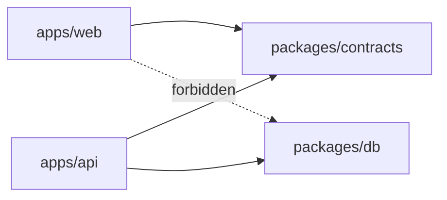
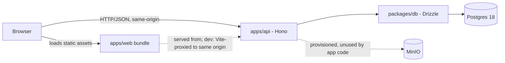
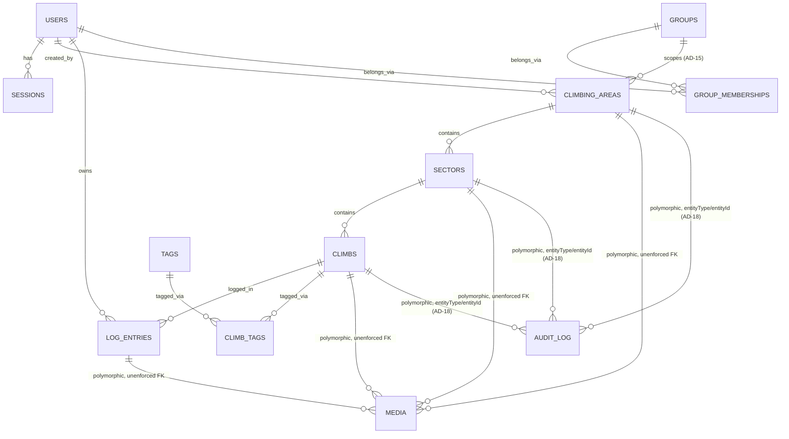

# Architecture Spine — climbing-logbook

## Design Paradigm

Layered client/API/data with a shared contract layer underneath both ends.

- `apps/web` — presentation/client layer. SvelteKit SPA (static build), talks to the API over HTTP/JSON only.
- `packages/contracts` — shared contract layer. Zod schemas (entities + Problem Details), zero DB/runtime dependency. Sits underneath both `apps/web` and `apps/api`.
- `apps/api` — application/API layer. Hono REST server; the only layer permitted to reach `packages/db`.
- `packages/db` — data layer. Drizzle ORM/Postgres.



## Invariants & Rules

### AD-1 — Frontend rewrite target [ADOPTED]

- **Binds:** apps/web
- **Prevents:** re-platforming on anything other than a plain web app, or reintroducing Angular. Dropping location capture from the area/sector-creation flow — that would silently undo the reason native was ruled unnecessary.
- **Rule:** apps/web is fully replaced by SvelteKit + shadcn-svelte. Plain web app for v1 — no native shell, no PWA. The browser Geolocation API must be used for on-site GPS capture when creating/editing an area or sector — this is the requirement that made dropping native/PWA safe, not an incidental nice-to-have.

### AD-2 — Rendering mode: static SPA, always same-origin

- **Binds:** apps/web, apps/api
- **Prevents:** introducing a Node SSR process or server-side cookie-forwarding. A cookie/CORS configuration that silently differs between dev and prod (e.g. `SameSite=None`+cross-origin in dev vs. same-origin in prod).
- **Rule:** apps/web builds as a static SPA (`ssr=false` / adapter-static). The browser always talks to apps/api same-origin: in dev, the SvelteKit Vite dev server proxies `/api/*` to `apps/api` (server-to-server — no CORS, no cross-site cookie involved); in production, AD-12's single-process serving is same-origin natively. Session cookies stay `SameSite=Lax` in every environment; no cross-site cookie path exists anywhere. `apps/api`'s existing `hono/cors` middleware (`WEB_ORIGIN`-driven) becomes dead but harmless once the dev proxy is in place — safe to leave, not required to remove.

### AD-3 — Frontend scaffolding & path

- **Binds:** apps/web
- **Prevents:** adopting a third-party community starter template, or creating a parallel `apps/web-svelte` folder.
- **Rule:** Scaffold fresh via the official Svelte CLI (`sv create` — SvelteKit 2 + Svelte 5 runes + Tailwind 4); add components via the official shadcn-svelte CLI (source copied in). Reuse the `apps/web` path — delete Angular from it, don't create a new folder.

### AD-4 — Error format: RFC 9457 Problem Details

- **Binds:** apps/api, apps/web
- **Prevents:** apps/api routes reverting to, or mixing in, the old ad-hoc `{error: string}` shape. Two routes shipping incompatible extension shapes for validation failures.
- **Rule:** All apps/api error responses use `application/problem+json` (type/title/status/detail/instance + extensions) across every route. Validation failures carry exactly one sanctioned extension member, `errors: [{path, message}]` — no route defines its own alternative shape.

### AD-5 — API docs: zod-openapi + Swagger UI

- **Binds:** apps/api
- **Prevents:** manual, undocumented body validation drifting from the actual contract. Per-route error handling drifting from AD-4's shape. A route (including the dev-login route) silently skipping schema definition.
- **Rule:** apps/api routes are built on `OpenAPIHono()` + `createRoute()` with Zod request/response schemas (`@hono/zod-openapi`), with `@hono/swagger-ui` mounted for browsable docs. Every route gets a schema this way, including `POST /api/auth/dev-login` (AD-10) and `POST /api/media` (multipart/form-data — zod-openapi supports non-JSON request bodies too). Exactly one global error handler (`app.onError` / a shared `defaultHook`) produces every Problem Details response — no per-route `hook` reimplements error formatting. Requires bumping `hono` to `^4.10.0` (from the currently-pinned `^4.6.0`) and pinning `zod` to `^4.0.0` — both are peer requirements of `@hono/zod-openapi@1.6.x`; verify `@hono/node-server` (`^1.13.0`, one major behind current) still works with the bumped `hono` when this lands.

### AD-6 — Shared contracts package

- **Binds:** apps/api, apps/web, packages/contracts
- **Prevents:** apps/web and apps/api independently duplicating or drifting on entity shapes, including the shapes that aren't raw DB rows.
- **Rule:** `packages/contracts` holds one Zod schema per entity (Area, Sector, Climb, Tag, LogEntry, Media) plus the Problem Details schema, **plus** the two response shapes that diverge from a raw table row: `ClimbWithTags` (what `GET /api/climbs/:id` actually returns — a `Climb` plus a `tags` array) and `AuthUser` (the public `{id, email, name}` shape auth endpoints return — never the full `users` row, which carries `passwordHash`). Base shapes are generated from `packages/db/src/schema.ts` via drizzle-zod (`createSelectSchema`/`createInsertSchema`) — the Drizzle schema stays the single source of column shape; the two composite shapes are hand-composed from those. apps/api uses these schemas for validation + OpenAPI; apps/web imports them for typed API responses.

### AD-7 — Dependency direction: apps/web must never reach packages/db

- **Binds:** apps/web, packages/db, packages/contracts
- **Prevents:** apps/web (or any future non-api-server consumer) importing `@climbing-logbook/db`, even type-only. `packages/contracts` (or its drizzle-zod generation step) importing the package's default barrel instead of a side-effect-free subpath, which would silently reintroduce the same problem one layer down.
- **Rule:** `packages/db/src/client.ts` opens a live Postgres connection and throws without `DATABASE_URL` as an import-time side effect of the default barrel export (`@climbing-logbook/db`), so that barrel stays reachable only from apps/api. `packages/db` must expose a second, side-effect-free entry point — `@climbing-logbook/db/schema` (a package.json `exports` map pointing only at `schema.ts`, never `client.ts`) — and `packages/contracts`'s drizzle-zod generation imports *only* that subpath, never the default barrel. `packages/contracts` exists specifically so apps/web never needs to import `packages/db` at all, in any form, to get types.

### AD-8 — Server-data state management

- **Binds:** apps/web
- **Prevents:** adopting a query/cache library (e.g. `@tanstack/svelte-query`) before it's earned. A second, ad-hoc `fetch()` call site that bypasses the shared client and drops `credentials: 'include'` or Problem Details error parsing.
- **Rule:** Use plain Svelte 5 runes plus exactly one hand-written API client module for v1 — small data volume, few users. Every request to apps/api goes through that one module; no component or route calls `fetch()` against apps/api directly.

### AD-9 — Two-tier E2E/test strategy

- **Binds:** apps/web, apps/api, packages/db
- **Prevents:** building a separate backend mock mode. `seed.ts` gaining a destructive truncate-first path that breaks re-running it against a non-empty test database.
- **Rule:** (1) Pure frontend/component tests use Playwright network mocking (`page.route` on `/api/**`), zero apps/api involvement. (2) Full-stack e2e run against a real apps/api + real Postgres with `NODE_ENV=test`, seeded with a small fixed set of named test users by extending `packages/db/src/seed.ts` — extended, not forked: one seed script stays idempotent (`onConflictDoNothing`/upsert, matching its existing pattern) and safe to re-run, in dev and in test, never a destructive reset.

### AD-10 — Simplified test login route

- **Binds:** apps/api
- **Prevents:** the dev-login route existing, even runtime-rejected, in a production instance.
- **Rule:** `POST /api/auth/dev-login` (pick a seeded user, no password) is conditionally *registered* on the Hono app only when `NODE_ENV !== 'production'` — it does not exist at all in production, not just runtime-rejected. Reuses the existing `NODE_ENV` check already used in `auth.ts` for the session-cookie secure flag; no separate `APP_ENV` is introduced.

### AD-11 — i18n via Paraglide JS

- **Binds:** apps/web, apps/api
- **Prevents:** the backend localizing responses or handling `Accept-Language`.
- **Rule:** apps/web uses Paraglide JS with German (default), English, French, runtime-switchable. apps/api never localizes: Problem Details `type` stays a stable English machine-readable identifier; apps/web maps known `type` values to localized Paraglide messages.

### AD-12 — Static file serving

- **Binds:** apps/api, apps/web
- **Prevents:** introducing a separate nginx/Caddy static/proxy container.
- **Rule:** apps/api serves the built SvelteKit static output directly (Hono/`@hono/node-server` static-file middleware) mounted at `/`, while `/api/*` stays the JSON API. One process, one container.

### AD-13 — Ownership model [ADOPTED, extended]

- **Binds:** apps/api (routes/areas.ts, routes/sectors.ts, routes/climbs.ts, routes/tags.ts, routes/logs.ts, routes/media.ts)
- **Prevents:** adding per-owner checks to areas/sectors/climbs/tags, or removing the ownership check on log_entries — either would silently change this model. `media.ts` enforcing `uploadedBy` as its own unsanctioned third ownership axis instead of following whatever it's attached to.
- **Rule:** areas/sectors/climbs/tags are shared-editable — any authenticated user may create/edit/delete them (no per-owner check), matching "small group of friends" scope. log_entries are per-user-owned — update/delete require `eq(userId, currentUser.id)`. Media follows whichever model its `entityType` points at: shared-editable when attached to an area/sector/climb (any authenticated user may delete it, consistent with those entities), per-owner when attached to a log_entry (only that log entry's owner may delete it). `uploadedBy` is recorded for attribution only, not used as a standalone permission check. **Amended by AD-15**: "any authenticated user" narrows to "any authenticated user in the area's group" once group scoping lands — v1 has exactly one group, so this is not a v1 behavior change.

### AD-14 — Map: Leaflet + OpenTopoMap + Nominatim geocoding

- **Binds:** apps/web
- **Prevents:** adopting a third-party Svelte-Leaflet wrapper package (several exist — sveltelet, sveaflet, svelte-leafletjs — none clearly dominant) instead of using Leaflet directly. Adopting a heavier vector-tile stack (e.g. MapLibre GL) this app has no need for.
- **Rule:** apps/web uses Leaflet directly — framework-agnostic, initialized in a Svelte component's lifecycle, no wrapper package. Default tile layer is OpenTopoMap raster tiles (free, no API key required, shows the hiking trails needed to reach climbing areas; attribution required, usage stays far below its low-volume policy threshold at this app's scale). Place search uses `leaflet-control-geocoder` (Nominatim-backed by default, free, no API key). The map view supports: areas rendered as markers, clicking the map to create a new area at that location, and geocoder search-to-locate/pan — these feed CAP-1's area-creation flow alongside (not instead of) browser-Geolocation capture (AD-1).

### AD-15 — Group scoping seam

- **Binds:** packages/db, apps/api (routes/areas.ts, sectors.ts, climbs.ts, logs.ts, media.ts), packages/contracts, apps/web
- **Prevents:** retrofitting group scoping onto live data later (expensive migration once real rows exist). A route checking authentication but not group membership and getting away with it because v1 only has one group — the exact latent gap already present today: `logs.ts` and `media.ts` GET routes currently have **no auth check at all**, let alone a group check. Denormalizing `groupId` onto `sectors`/`climbs` and letting a copy drift from the owning area's real group. A client-supplied `groupId` in a request body overriding the server-derived one.
- **Rule:** New `groups` (id, name, createdAt) and `group_memberships` (userId, groupId, joinedAt) tables. `climbing_areas` gains a required `groupId` FK — the single source of truth for group scope. A single shared helper/middleware (`requireGroupMember`, alongside the existing `requireAuth`) resolves the caller's group and enforces it on **every** area/sector/climb/log_entry/media route, read and write alike — never a one-off join per route. For `sectors`/`climbs`/`log_entries` this means joining up through the existing FK chain to `climbing_areas.groupId` (never a denormalized copy). For `media` — polymorphic `entityType`/`entityId`, already flagged as an "unenforced FK" in its own schema comment — the helper dispatches on `entityType` to the correct parent table and that parent's group; there is no shortcut around this 4-way dispatch. The drizzle-zod-generated insert schema for `climbing_areas` omits `groupId` from client input entirely (same discipline already used for `createdBy`, which routes already take from the session, never the body) — a route derives `groupId` from the caller's own membership, never trusts it from the request. How a user actually gets a `groupId` in the first place is AD-16, not this AD. `tags` stay instance-wide/global (a shared vocabulary; a tag name carries no private data, so it does not need group scope). Amends AD-13's ownership model to "within the caller's group."

### AD-16 — Group membership: invite-to-join or create-your-own

- **Binds:** apps/api (routes/auth.ts), packages/db (groups, group_memberships)
- **Prevents:** a typo'd or expired invite code silently falling back to creating a brand-new group instead of erroring (surprising, hard-to-debug data fragmentation). Enforcing "one group per user" as a DB constraint that would need a migration to lift later.
- **Rule:** `groups` gains `inviteCode` (unique text, regenerable). `inviteCode` is generated with `randomBytes` (same crypto-random source already used for session tokens in `lib/session.ts`, sized for a short shareable code, e.g. 6 bytes base64url) — never a counter, slug, or anything guessable. `POST /api/auth/register` accepts an optional `inviteCode`: absent → create a new group, the caller becomes its only member; present and valid → join that group; present and invalid → `400`/Problem Details error, never a silent fallback. One group per user for v1 is enforced at the **app layer only**, not a DB unique constraint — lifting it later to allow multi-membership is an app-code change, not a schema migration. Any member of a group can regenerate its `inviteCode` (a single atomic `UPDATE`), immediately invalidating the old one.

### AD-17 — Containerized deployment

- **Binds:** apps/api, apps/web, packages/db, packages/contracts, docker-compose.yml
- **Prevents:** a deploy that needs more than `docker compose up -d` (a separate manual migration step, a separate frontend build/serve step). Uploaded media living only inside a container's writable layer, lost on recreate.
- **Rule:** A multi-stage Dockerfile: a build stage compiles `packages/db`, `packages/contracts`, `apps/api`, and `apps/web` (SvelteKit static output); the final stage is a slim `node:22-alpine` runtime carrying only `apps/api`'s compiled output, `apps/web`'s static build, and production dependencies, running `node dist/index.js` (which also serves the static build, per AD-12). Migrations run automatically on container startup, before the HTTP server binds — safe here because this is a single-instance self-hosted deploy with no multi-replica race to guard against. `docker-compose.yml` gains an `app` service: `depends_on: postgres` gated on its healthcheck, environment (`DATABASE_URL`, `API_PORT`, `NODE_ENV=production`, `UPLOADS_DIR`), and a named volume for uploads, persisted the same way `postgres_data` already is.

### AD-18 — Audit trail for shared-entity edits

- **Binds:** apps/api, packages/db
- **Prevents:** two different routes inventing their own change-tracking shape. A DB-trigger-based audit mechanism invisible from the TypeScript route code an agent reasons about. Losing an audit row's group attribution once its parent area/sector/climb is deleted.
- **Rule:** One generic `audit_log` table (`entityType`, `entityId`, `actorUserId`, `action` [create|update|delete], `changes` jsonb, `groupId`, `createdAt`), written by a single shared app-layer helper called from every mutating route on areas/sectors/climbs — the shared-editable entities where "who changed this" matters. `groupId` is a **denormalized snapshot captured at write time** — the one deliberate exception to AD-15's "no denormalized copy" rule, because a `delete` row must stay group-attributable after its parent row is gone and a live join can no longer reach it. Not DB triggers, not per-entity history tables. `log_entries`/`media`/`tags` are not audited (already per-owner, or low-stakes).

### AD-19 — Grade enum, climb length, climb own-location

- **Binds:** packages/db (schema.ts), packages/contracts, apps/api, apps/web
- **Prevents:** `difficulty` staying free text once a stats/badge system depends on a real order over it. A second, ad-hoc length/location field bolted onto a different table than `climbs`.
- **Rule:** `climbs.difficulty` becomes a constrained enum column (a `climbGradeValues` `as const` array, matching the existing `climbKindValues`/`logStatusValues` pattern already in `schema.ts`) spanning `4a` through `9c+` in standard `a`/`a+`/`b`/`b+`/`c`/`c+` increments, shared by routes and boulders — not two separate grade scales. `climbs` gains nullable `length` (integer, meters — shown in the UI only for `kind = "route"`) and nullable `latitude`/`longitude` (`doublePrecision`, same pattern as `sectors`). "Always null for boulders" is enforced at the **contract layer**: `packages/contracts`'s `Climb` create/update Zod schema rejects a non-null `length` when `kind = "boulder"` via `.refine()` — not a DB `CHECK` constraint, not "trust the frontend." A direct API call with `kind: "boulder"` and a `length` value fails validation the same way any other bad request does. When a climb has no location of its own, the frontend displays it at its parent sector's (or area's) location — a display fallback, not a DB default. `packages/contracts`'s drizzle-zod-generated `Climb` schema (AD-6) picks up the enum and the two nullable columns automatically; the boulder/length refinement above is the one piece that needs hand-adding.

### AD-20 — App-content search

- **Binds:** apps/api, apps/web
- **Prevents:** client-side-only filtering that can only ever search whatever's currently loaded in the active view, silently missing the rest of the group's data. A full-text-search extension (`pg_trgm`/`tsvector`) this app's data volume doesn't need. A search query correctly resolving the caller's `groupId` but wrongly filtering the `climbs`/`sectors` sub-queries with it — resolving `groupId` and applying it at the right join depth are two different mistakes to make.
- **Rule:** A dedicated `GET /api/search` endpoint — not client-side filtering — because search must cover the caller's whole group, not just the current view. One query string routes two ways, unioned into one result set: matched as a case-insensitive substring (`ILIKE`) against area/sector/climb `name`, **and** matched (after lowercasing the input) as an exact match against the grade enum (AD-19) for climbs only. Each entity's group filter uses the *same join depth its single-entity route already uses* — direct `groupId` for areas, one join (`sectors → climbing_areas.groupId`) for sectors, two joins (`climbs → sectors → climbing_areas.groupId`) for climbs — reusing AD-15's `requireGroupMember` gets you the caller's `groupId`, it does not by itself get the join right.

### AD-21 — Gamification and achievements computed live

- **Binds:** apps/api, packages/db
- **Prevents:** a maintained/denormalized flash-count or achievement column that can drift from `log_entries` — the same failure mode AD-15/AD-16/AD-18 already guard against elsewhere, recurring here under a new name. A non-deterministic "hardest send" pick when a user has multiple flashes/redpoints tied at their hardest grade.
- **Rule:** The per-grade flash-count toast and the stats-page Achievements section are both live `COUNT`/query results against `log_entries` (joined to `climbs` for grade) — never a cached counter column. Data volume at this app's scale makes the query cost negligible; a cache is solving a problem that doesn't exist yet. Achievements' "hardest send" ties (same grade, multiple climbs) break by most-recent `log_entries.createdAt` — deterministic, no arbitrary row picked by whatever order the query planner happens to return.

### AD-22 — Geolocation-based area suggestion

- **Binds:** apps/web
- **Prevents:** a new backend geo-query/index for a problem the client can already solve with data it holds.
- **Rule:** Client-side only: Haversine distance between the device's current position (AD-1's existing browser Geolocation capture) and each area in the caller's already-fetched group area list (typically a handful of rows). Areas within a configurable default threshold (~2km) are suggested. No new endpoint, no server-side geo query.

## Consistency Conventions

| Concern | Convention |
| --- | --- |
| Naming (entities, files, interfaces, events) | Shared entity schemas in `packages/contracts` are named singular PascalCase (Area, Sector, Climb, Tag, LogEntry, Media), mirroring `packages/db/src/schema.ts` table names, and are derived from it via drizzle-zod (see AD-6). |
| Data & formats (ids, dates, error shapes, envelopes) | Ids are `uuid` on every table (Drizzle `defaultRandom()`). Wire keys are camelCase (Drizzle's JS-side field names, e.g. `howToGetThere`); db columns are snake_case — Drizzle maps this automatically, no separate case-conversion layer [ADOPTED]. Success responses are the raw resource JSON (object or array, no wrapper): 201 on create, 204 no-body on delete [ADOPTED]. Error responses are `application/problem+json` per RFC 9457 (see AD-4). Ownership-scoped writes (e.g. `logs.ts` update/delete) return 404 — not 403 — for both "not found" and "not yours," avoiding existence leakage [ADOPTED]; new ownership-scoped routes follow the same pattern. |
| State & cross-cutting (mutation, errors, logging, config, auth) | `NODE_ENV !== 'production'` gates both the session-cookie secure flag (existing, auth.ts) and the registration of `POST /api/auth/dev-login` (see AD-10) — no separate `APP_ENV`. Session cookies are `SameSite=Lax` everywhere; the frontend/API boundary is same-origin in every environment, dev included (see AD-2) — no cross-site cookie path exists. Ownership: areas/sectors/climbs/tags/media(-on-those) are shared-editable *within the caller's group*, log_entries and media-on-log_entries are per-owner (see AD-13, amended by AD-15). apps/api is the sole layer permitted to reach packages/db's default barrel; `packages/db/schema` is the only subpath anything else may import (see AD-7). Every mutating route on areas/sectors/climbs calls the shared audit-log helper (see AD-18). Package versions follow semver; bump on release, tag in git — no new versioning mechanism beyond what `packages/db`/`apps/api` already do. |

## Stack

| Name | Version |
| --- | --- |
| TypeScript | ^5.6.0 |
| Node.js | 22.x (per @types/node ^22.10.0) |
| Hono | ^4.10.0 (bumped from currently-pinned ^4.6.0 — required peer of @hono/zod-openapi@1.6.x, see AD-5) |
| Zod | ^4.0.0 (newly pinned — required peer of @hono/zod-openapi@1.6.x; compatible with drizzle-zod ≥0.8.1) |
| @hono/node-server | ^1.13.0 (one major behind current 2.1.1 — unverified against the Hono bump above, not proven broken; re-check when AD-5 lands) |
| @hono/zod-openapi | ~1.6.x |
| @hono/swagger-ui | latest (unpinned at authoring) |
| drizzle-orm | ^0.36.0 |
| drizzle-kit | ^0.28.0 (behind current 0.31.10 — unverified, not proven broken; pre-existing pin, not changed by this session) |
| drizzle-zod | 0.8.1+ (confirmed compatible with drizzle-orm ^0.36.0 and Zod v4) |
| postgres (postgres.js driver) | ^3.4.4 |
| Postgres (database) | 18 (docker-compose `postgres:18`) |
| SvelteKit | 2 |
| Svelte | 5 (runes) |
| Tailwind CSS | 4 |
| shadcn-svelte | CLI-installed (source copied in, no package version pin) |
| Paraglide JS | latest (unpinned at authoring) |
| Playwright | latest (unpinned at authoring) |
| Leaflet | latest (unpinned at authoring; used directly, no Svelte wrapper package — see AD-14) |
| leaflet-control-geocoder | latest (unpinned at authoring; Nominatim-backed — see AD-14) |

No new stack dependency was introduced by AD-19/20/21/22 — the grade enum, search endpoint, gamification queries, and geolocation suggestion all build on packages/db/apps/api/apps/web as already pinned above.

## Structural Seed



docker-compose provisions `postgres` and `minio`; minio is not yet used by app code — media storage currently defaults to local disk (`apps/api/src/lib/storage.ts`).



`TAGS` is deliberately outside any group's scope (AD-15) — a global, instance-wide vocabulary.

```text
climbing-logbook/
  apps/
    api/                   # Hono REST API (OpenAPIHono + zod-openapi) - only layer touching packages/db
      src/
        routes/            # areas, sectors, climbs, tags, logs, media, auth, search (AD-20)
        middleware/        # auth (session attach)
        lib/               # storage, session
        context.ts
        index.ts           # app wiring; serves built apps/web static output at '/'
    web/                   # SvelteKit SPA (Svelte 5 runes, Tailwind 4, shadcn-svelte), static build
      src/
        routes/            # SvelteKit pages/layouts
        lib/               # API client, Paraglide messages, shared UI
      e2e/                 # Playwright tests (mocked-component tier + full-stack tier)
  packages/
    db/                    # Drizzle ORM schema, migrations, seed - Postgres only
      src/
        schema.ts           # exported standalone via "@climbing-logbook/db/schema" - zero side effects
                             # tables: users, sessions, groups, group_memberships (AD-15),
                             # climbing_areas (+groupId), sectors, climbs (+difficulty enum,
                             # length, lat/lng - AD-19), tags, climb_tags, log_entries, media,
                             # audit_log (+groupId snapshot - AD-18)
        client.ts          # opens live Postgres connection at import time - default barrel only, apps/api-only
        seed.ts             # idempotent; reused as-is for NODE_ENV=test seeding (AD-9); also bootstraps the v1 default group
    contracts/             # new: Zod schemas per entity (via drizzle-zod) + Problem Details schema, zero DB/runtime dependency
  Dockerfile                # multi-stage: builds db/contracts/api/web, slim node:22-alpine runtime (AD-17)
  docker-compose.yml        # postgres, minio (provisioned, unused by app code yet), app (AD-17) + uploads volume
```

## Deferred

- TLS termination / exposing the self-hosted instance beyond localhost (reverse proxy, cert management) — a hosting-environment decision for whoever stands this up, not core app architecture. Revisit when someone actually deploys it beyond local/LAN use.
- Pagination / advanced filtering beyond simple query-param equality filters (see `logs.ts` climbId/userId filters) — personal-scale data volume doesn't need it for v1. Revisit if the group/dataset grows.
- Offline-first (local queue-and-sync for new sectors/images while offline) — explicitly descoped for v1 as overengineering, not rejected forever. Online-only is fine for now; revisit post-v1 if trip connectivity turns out to be a real problem.
- No capability spec exists yet for this project (this run went straight from a brainstorming session to architecture). Sequence epics/stories against a `bmad-spec`-authored spec before implementation, not the other way around.
- SvelteKit 3 entered Release Candidate the same month this spine was authored (September 2026). This spine targets SvelteKit 2 (current stable) deliberately — do not preemptively target the RC. Revisit only if 3 stabilizes before the frontend rewrite starts.
- Lower-priority contract-drift items surfaced by the adversarial review (OpenAPI component-naming consistency across routes, PATCH partial-update schema shape) — see `reviews/review-divergence.md`. Worth a pass during `apps/api` route implementation, not blocking for this spine.
- A user belonging to more than one group at once, and any group-switcher UI that would require — AD-17 gives every user exactly one group for v1 (by app-layer choice, not a schema limit). Revisit only if multi-membership becomes a real need.
- A UI for browsing the audit trail (AD-16 writes it; nothing reads it back yet) — the data exists for whenever it's needed, no viewer decided.
